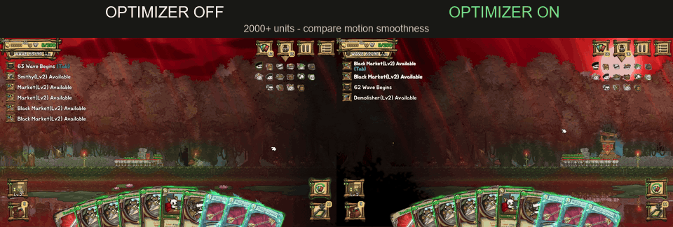

# Ratropolis Performance Mod

An unofficial BepInEx mod that reduces severe late-game slowdown when a
Ratropolis save contains a very large friendly army.

The optimizer replaces thousands of friendly `AttackRange` Physics2D trigger
checks with a centralized one-dimensional range scan. Units, animations,
damage text, combat behavior, and save files remain intact.

## Performance Comparison

Tested on a late-game save with more than **2,000 units**. The FPS counter
shows only part of the improvement; the difference in motion smoothness and
frame pacing is much clearer in the comparison below.



## Download and Install

1. Open the latest page under
   [GitHub Releases](https://github.com/21twoone/RatropolisPerformanceMod/releases).
2. Download `RatropolisPerformanceMod-v1.0.0-win-x86.zip`.
   Do not download GitHub's automatic `Source code` archives.
3. In Steam, right-click **Ratropolis**, then select
   **Manage > Browse local files**.
4. Close Ratropolis.
5. Extract the zip directly into the Ratropolis game folder. Allow folders to
   merge when Windows asks.
6. Start the game. The top-left corner should show:

```text
FPS 60 | Optimizer ON
```

If BepInEx is already installed, the smaller
`RatropolisPerformanceMod-v1.0.0-plugin-only.zip` can be extracted into the
same game folder instead.

## Controls

- `F6`: enable or disable the optimizer.
- `F7`: show or hide the compact HUD.

The optimizer starts working when the total unit count reaches the configured
threshold. Keep it enabled during normal play.

## Uninstall

Close the game and delete:

```text
BepInEx\plugins\RatropolisPerformanceMod.dll
```

The mod does not modify save files. Removing BepInEx itself is optional.

## Build from Source

Requirements:

- .NET SDK capable of targeting .NET Framework 3.5
- A local Ratropolis installation
- BepInEx 5.4.23.4 x86 extracted under
  `deps\BepInEx_win_x86_5.4.23.4`

PowerShell:

```powershell
$env:RATROPOLIS_DIR = 'C:\path\to\Steam\steamapps\common\Ratropolis'
dotnet build -c Release
```

The project references local game assemblies only for compilation. No
Ratropolis files are committed or distributed.

## Compatibility

- Ratropolis Steam App ID `1108370`
- Unity Mono x86
- BepInEx `5.4.23.4` x86

This is an unofficial community mod and is not affiliated with Cassel Games.
Back up important saves before installing any game mod.

## License

Source code is available under the [MIT License](LICENSE).
